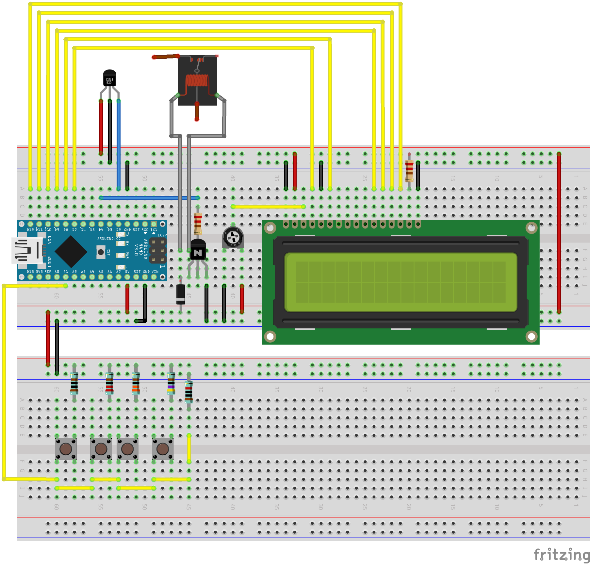

# arduino-radiator-booster

## Dependencies used:
* LiquidCrystal (for 16x2 Display)
* EEPROMWearLevel (for wear level agnostic persistant storage)
* DHT (sensor, in this case a DHT11)

## Hardware Test Setup
* Board: Arduino Nano R3
* Temp Sensor: DHT11
* Display: 16x2 generic LCD display
* Relay: SRD-05VDC-SL-C
* Adjustable resistor 5k
* NPN Transistor Generic
* Generic Momentary switches and an asortment of resistors

Note: Relay and relay setup is only displayed partially. I've used an external 12v Power Supply and some PC fans.

## About
This software, combined with the hardware is able to boost your heating produced by a radiator (of any kind) allowing for a greater heat exchange thus better living quality. In conjunction with hardware this software will trigger fans of some sort to increase airflow during a heating period by detecting a certain temperature threshold.

## Notice
This functionality, might be not allowed in your jurisdiction. Please check the current law before modifying your heating.

## Sidenote
Created as a side project. This should help other developers to inspire confidence, allow them to further modify and customize the project to their needs. I'm not a C / C++ Programmer. Some of these lines of code might look odd or outright wrong. If you want to contribute, feel welcome but be nice and constructive.
